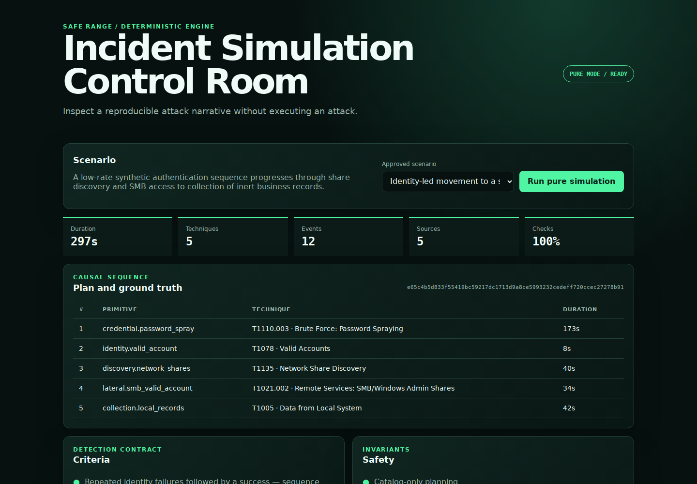

# autonomous-incident-simulator

A safe, deterministic engine for generating cyber-incident exercises, synthetic
multi-source telemetry, detection contracts, analyst questions, and measurable
ground truth.

The project deliberately does **not** execute offensive instructions. A scenario
can only select identifiers from a compiled catalog of pure state transitions.
Descriptions and analyst prompts remain inert data. There is no shell adapter,
process runner, outbound network client, dynamic plugin loader, or model-generated
execution path in the engine.

## Dashboard Preview



Local dashboard running a pure simulation from the repository’s `examples/` scenarios.

## Flagship result

`payroll-no-malware` models the objective “compromise the payroll server without
malware” under a 30-minute ceiling. The current golden run produces:

| Measure | Result |
|---|---:|
| Simulated duration | 200 s |
| ATT&CK techniques | 6 |
| Telemetry events | 12 |
| Telemetry sources | 9 |
| Detection criteria passed | 3/3 |
| Expected results passed | 5/5 |
| Repeated outputs with one digest | 50/50 |
| Median local engine latency | 1.479 ms |
| Local p95 engine latency | 1.948 ms |

Latency was measured on one development machine and is not a cross-platform
performance claim. The deterministic SHA-256 is
`62bfe9f7034703656420f794fe5f5d4fe2d5f0e59988195d6424d6c1b967318a`.
The committed [golden report](datasets/golden/payroll-no-malware/report.json),
[JSONL telemetry](datasets/golden/payroll-no-malware/telemetry.jsonl), and
[benchmark](datasets/golden/payroll-no-malware/benchmark.json) make the result
independently reproducible.

## What is implemented

- Versioned JSON DSL and published JSON Schema.
- Semantic fail-closed validator beyond structural schema validation.
- Objectives, hard duration/step limits, required techniques, required telemetry,
  forbidden capabilities, expected outcomes, and analyst questions.
- Seeded topology generation using documentation-only IP ranges.
- Closed catalog of 11 inert primitives mapped to ATT&CK metadata.
- Deterministic breadth-first planner that satisfies the complete constraint set.
- Pure simulator producing identity, endpoint, email, proxy, network, firewall,
  operating-system, application, file-audit, and SIEM-style events.
- Causal plan, ATT&CK ground truth, detection evaluation, expected-result evaluation,
  coverage measures, and explicit safety invariants.
- JSON report, JSONL, Markdown, ground-truth, and clearly labeled STIX-inspired exports.
- CLI, local HTTP API, and a dependency-free dashboard.
- Three reproducible scenarios, a golden dataset, benchmark, 30 automated tests,
  and repository-level safety/reproducibility gates.
- Non-root, read-only-capable container and least-privilege Compose configuration.

## Architecture

```text
Untrusted scenario JSON
          │
          ▼
Structural + semantic validation ───── fail closed
          │
          ├── versioned objective and constraints
          └── catalog identifiers only
          │
          ▼
Seeded topology ──► deterministic BFS planner
                              │
                              ▼
                   pure state-transition simulator
                              │
              ┌───────────────┼────────────────┐
              ▼               ▼                ▼
        telemetry        ground truth       evaluation
              └───────────────┼────────────────┘
                              ▼
                 JSON / JSONL / Markdown /
                 labeled STIX-inspired bundle
                              │
                         CLI + local API
                              │
                           dashboard
```

The detailed design and trust boundaries are documented in
[Architecture](docs/architecture.md) and [Threat model](docs/threat-model.md).

## Quick start

Python 3.10 or later is required. The runtime and test suite use only the Python
standard library.

```bash
export PYTHONPATH=src
python3 -m incident_simulator validate examples/payroll-no-malware.json
python3 -m incident_simulator simulate examples/payroll-no-malware.json \
  --output-dir out/payroll-no-malware
python3 -m incident_simulator benchmark examples/payroll-no-malware.json --runs 50
```

For an installed `incident-sim` executable:

```bash
python3 -m venv .venv
. .venv/bin/activate
python -m pip install -r requirements-build.lock -r requirements-dev.lock
python -m pip install --no-build-isolation --no-deps -e .
incident-sim catalog
```

## Dashboard and API

```bash
make serve
# Open http://127.0.0.1:8080
```

Read endpoints:

- `GET /api/v1/health`
- `GET /api/v1/catalog`
- `GET /api/v1/scenarios`
- `GET /api/v1/scenarios/{id}`

Pure simulation endpoint:

```bash
curl --fail --silent \
  -H 'Content-Type: application/json' \
  --data-binary @examples/payroll-no-malware.json \
  http://127.0.0.1:8080/api/v1/simulate
```

The server binds to loopback by default, rejects non-JSON and oversized bodies,
does not enable cross-origin access, and applies browser security headers. It has
no authentication and is not intended to be exposed directly to an untrusted
network.

## Scenarios

| Scenario | Objective | Techniques | Sources |
|---|---|---:|---:|
| `payroll-no-malware` | Identity-led access to synthetic payroll records | 6 | 9 |
| `file-share-lateral-movement` | Synthetic file-share collection path | 5 | 5 |
| `public-app-boundary` | Inert public application boundary failure | 3 | 4 |

Each scenario declares its own positive detection contract, expected results, and
questions for an analyst. See [DSL reference](docs/dsl.md).

## Quality gates

```bash
make test       # unit, integration, API, export, CLI end-to-end
make quality    # static safety/types, scenario contracts, golden regeneration
make benchmark
```

CI runs formatting, lint, strict static types, and tests on Python 3.10, 3.11, and
3.12, then builds and validates the hardened container. A scenario fails CI if two
executions differ, a required technique or source is absent, a
detection/expectation fails, or the golden dataset drifts.

## Container

```bash
docker compose up --build
```

Compose binds only to `127.0.0.1`, removes Linux capabilities, enables
`no-new-privileges`, mounts a read-only root filesystem, and constrains memory,
CPU, and process count.

## Honest scope

This is an exercise generator and evaluation harness, not a penetration-testing
framework and not a production digital twin. It does not contact hosts, replay
packets, run operating-system instructions, validate detections against a real
SIEM, or prove that a control blocks a real adversary. ATT&CK mappings are curated
metadata and must be reviewed as the upstream knowledge base evolves. The
STIX-inspired export is intentionally marked non-conformant.

See [Methodology](docs/methodology.md) and [Limitations](docs/limitations.md) for
the experimental assumptions and remaining work.

## Repository map

```text
src/incident_simulator/   typed engine, CLI, API, dashboard
schemas/                  versioned structural DSL contract
examples/                 reviewed reproducible scenarios
datasets/golden/          report, telemetry, truth, export, benchmark
tests/                    unit, integration, API, and end-to-end tests
scripts/                  deterministic repository quality gates
docs/                     architecture, methodology, threat model, limits
```

## License and responsible use

MIT licensed. Use only synthetic scenarios and systems you are authorized to
test. See [Security policy](SECURITY.md) and [Contributing](CONTRIBUTING.md).
